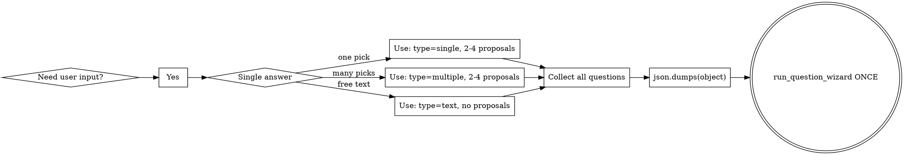

# Ask Questions via Question Wizard

When you need information from the user (any form of questioning), you MUST use the Question Wizard tool — not free-text questions in the chat.

## Universal Router

This skill is THE way to ask questions to the user. It supersedes all other question-asking patterns. Any skill or context that needs user input must route through `run_question_wizard`.

**Other skills that ask questions:**
- **brainstorming** — when exploring requirements, use `run_question_wizard` to present options and gather preferences.
- **challenger mode** (system prompt) — when surfacing assumptions, use `run_question_wizard` for confirmation.
- **openspec skills** — when clarifying requirements or presenting design choices, use `run_question_wizard`.
- **Any other skill** — if it would ask the user a question, route it here.

Do not duplicate question-asking logic in other skills. Reference this skill instead.

<REASONING>
Ask yourself: "Am I trying to get answers from the user?"
If YES → DO NOT proceed. Invoke this skill immediately.
Only skip if the user explicitly says "just guess" or similar opt-out language.
</REASONING>

<HARD-GATE>
Do NOT write any questions as plain text in your response.
Do NOT call `run_question_wizard` more than once.
Build ALL questions into a SINGLE JSON object, then call `run_question_wizard` Exactly ONCE.
</HARD-GATE>

## When to Invoke

| Trigger | Action |
|---|---|
| User asks for feedback/opinions | → Question Wizard |
| You need to narrow down requirements | → Question Wizard |
| You want user preferences/priorities | → Question Wizard |
| You need to collect survey data | → Question Wizard |
| You need to clarify ambiguous input | → Question Wizard (if 2+ clarifications needed) |

## The Two Rules

### Rule 1: ONE call only

Build every question into **one** JSON object, then call `run_question_wizard` **Exactly once**. The tool has a class-level lock — calling it twice returns an error.

### Rule 2: JSON string, not object

The parameter is a **JSON string** (`json.dumps(...)`). Never pass a dict or array directly.

## JSON Shape

Root MUST be an **object** `{}`, never an array `[]`.

```python
json.dumps({
    "title": "Your title",          # optional
    "description": "Context",        # optional
    "submit_label": "Envoyer",       # optional, default "Envoyer"
    "questions": [                   # REQUIRED — 1 to 13 items
        { /* question object */ },
    ]
})
```

## Question Types

### single — pick ONE (radio)

```python
{
    "question": "Which option?",
    "type": "single",
    "proposals": ["Yes", "No", "Maybe"],   # 2-4 strings, REQUIRED
    "allow_text": True                     # optional
}
```

### multiple — pick MANY (checkboxes)

```python
{
    "question": "Which features?",
    "type": "multiple",
    "proposals": ["A", "B", "C", "D"],     # 2-4 strings, REQUIRED
    "allow_text": True
}
```

### text — free writing (textarea)

```python
{
    "question": "Any comments?",
    "type": "text",
    "placeholder": "Write here..."         # optional
}
```

## Quick Decision Tree



## Complete Examples

### Example 1: Quick Project Clarification

User says: "Build me something for my shop."

❌ WRONG — asking in plain text:
```
Sure! To help me narrow it down:
1. What kind of shop is it?
2. What tech stack do you prefer?
3. Any budget constraints?
```

✅ RIGHT — using Question Wizard:

```python
import json

json.dumps({
    "title": "Project Discovery",
    "description": "Let's narrow down what you need.",
    "questions": [
        {
            "question": "What kind of shop?",
            "type": "single",
            "proposals": ["E-commerce", "Portfolio", "Blog", "SaaS"]
        },
        {
            "question": "Which tech stack do you prefer?",
            "type": "multiple",
            "proposals": ["React", "Vue", "Python", "Node.js"],
            "allow_text": True
        },
        {
            "question": "Any specific requirements or constraints?",
            "type": "text",
            "placeholder": "Tell me anything relevant..."
        }
    ]
})
```

### Example 2: Feedback on a Design Proposal

User says: "What do you think of this design?"

After giving your analysis, instead of asking follow-ups in text:

```python
import json

json.dumps({
    "title": "Design Feedback",
    "questions": [
        {"question": "Does this match your vision?", "type": "single", "proposals": ["Yes", "Partially", "No"]},
        {"question": "Which parts need changes?", "type": "multiple", "proposals": ["Layout", "Colors", "Typography", "Functionality"], "allow_text": False},
        {"question": "What would you change?", "type": "text"}
    ]
})
```

### Example 3: Employee Onboarding Status

User says: "Help me check on new hire onboarding."

```python
import json

json.dumps({
    "title": "Onboarding Check",
    "description": "Quick status update.",
    "submit_label": "Send",
    "questions": [
        {"question": "Was IT setup complete on day one?", "type": "single", "proposals": ["Yes", "No", "In Progress"]},
        {"question": "What's still pending?", "type": "multiple", "proposals": ["Email", "Access Cards", "Software", "Training"], "allow_text": True},
        {"question": "Any blockers to report?", "type": "text", "placeholder": "Describe any issues..."}
    ]
})
```

## Anti-Patterns

### ❌ Asking questions in plain text

```
Great, let me ask you a few things:
- What's your timeline?
- What's the budget?
```

Every question must go through the tool, period.

### ❌ Multiple wizard calls

```python
# WRONG — two calls in one response
await run_question_wizard(json.dumps({"questions": [q1]}))
await run_question_wizard(json.dumps({"questions": [q2]}))
```

One call. All questions inside it.

### ❌ Passing a dict or array directly

```python
# WRONG — questions_json is typed as str
await run_question_wizard({"questions": [q1]})              # no!
await run_question_wizard(json.dumps([{"question": "OK?"}])) # no! root must be {}
```

### ❌ Wrong keys

Never use `options`, `choices`, `answers`. The only valid keys are:
- Root: `title`, `description`, `submit_label`, `questions`
- Question: `question`, `type`, `proposals`, `allow_text`, `placeholder`

## Common Mistakes

| Mistake | Fix |
|---|---|
| Root is `[` not `{}` | Wrap in `{"questions": [...]}` |
| < 2 or > 4 proposals | Must be 2-4 |
| Missing `question` key | Every item needs `"question": "..."` |
| Using `options` instead of `proposals` | Key name is strict |
| Calling twice in one turn | Build one JSON, one call |
| Forgetting `json.dumps()` | Parameter is a string |
